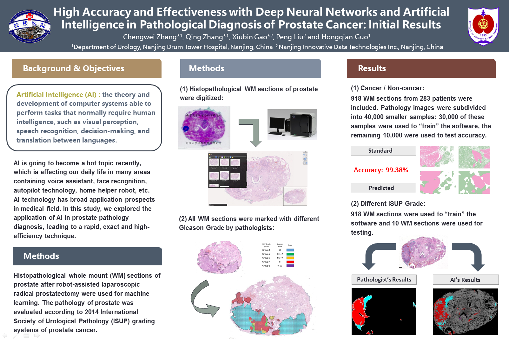

## High Accuracy and Effectiveness with Deep Neural Networks and Artificial Intelligence in Pathological Diagnosis of Prostate Cancer: Initial Results

### Abstract
Zhang C.,Zhang Q.,Gao X.,Liu P.,Guo H.,"High accurancy and effectiveness with deep neural networks and artificial intelligence in pathological diagnosis of prostate cancer: Initial results," in European Urology Supplements, volume 17,issue 2, pages e304-e308, 2018.  
[High accurancy and effectiveness with deep neural networks and artificial intelligence in pathological diagnosis of prostate cancer: Initial results](https://doi.org/10.1016/S1569-9056(18)31063-7)  

### Poster
  

### Press Reports
[Smart software can diagnose prostate cancer as well as a pathologist](https://eau18.uroweb.org/smart-software-can-diagnose-prostate-cancer-as-well-as-a-pathologist/)  
[EAU TV: Smart software can diagnose prostate cancer as well as a pathologist](https://eau18.uroweb.org/eau-tv-dr-chengwei-zhang/)  
